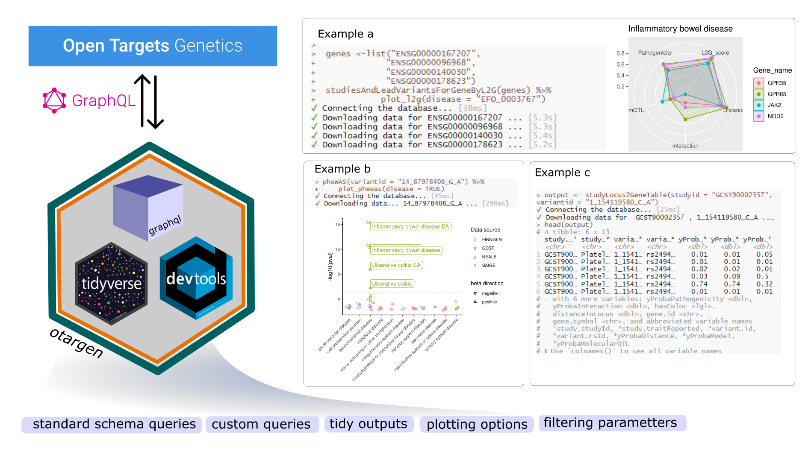

# otargen

`otargen` is an open-source and freely available R package that facilitates data retrieval and analysis from Open Target Genetics portal in the R programming environment. `otargen` functions cover all the GraphQL query types in Open Target Genetics schema, and return tidy data tables. It also includes several useful plotting functions to help visualize and gain insight from core complex data tables.



## Installation

You can install the development version of `otargen` as follows:

``` r
devtools::install_github("amirfeizi/otargen")
```

-   Install latest development version from GitHub (requires [devtools](https://github.com/hadley/devtools) package):

``` r
if (!require("devtools")) {
  install.packages("devtools")
}
devtools::install_github("https://github.com/amirfeizi/otargen.git")
```
