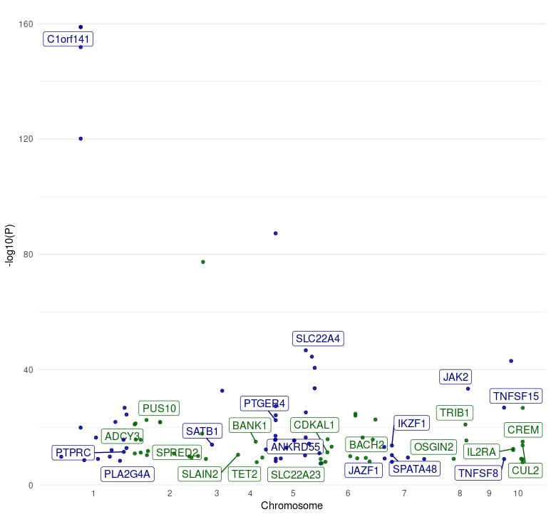
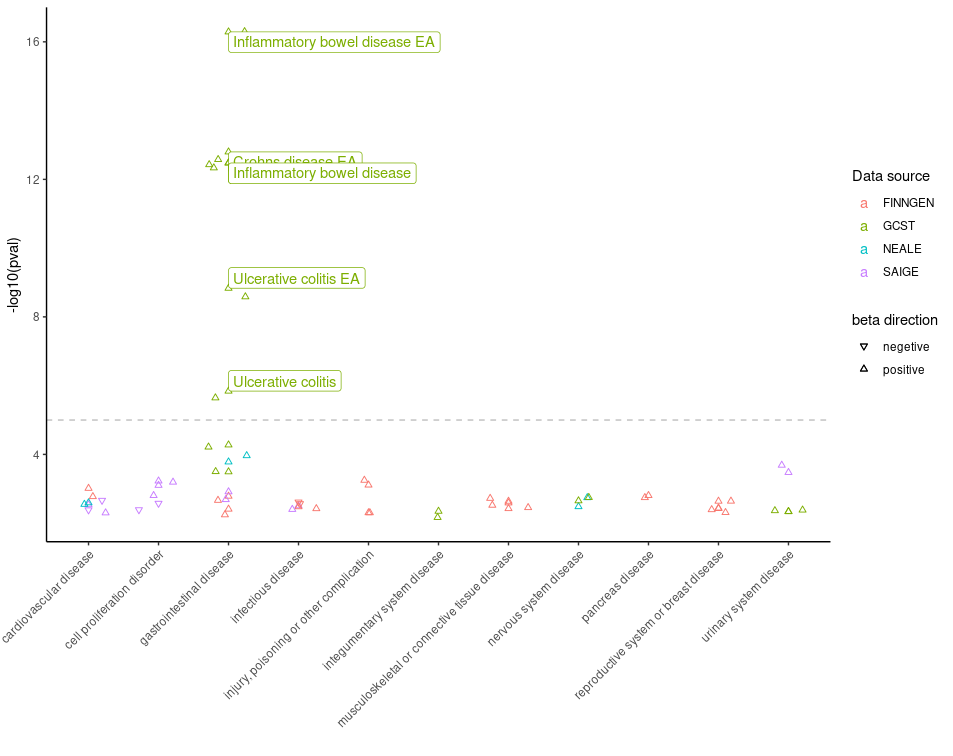
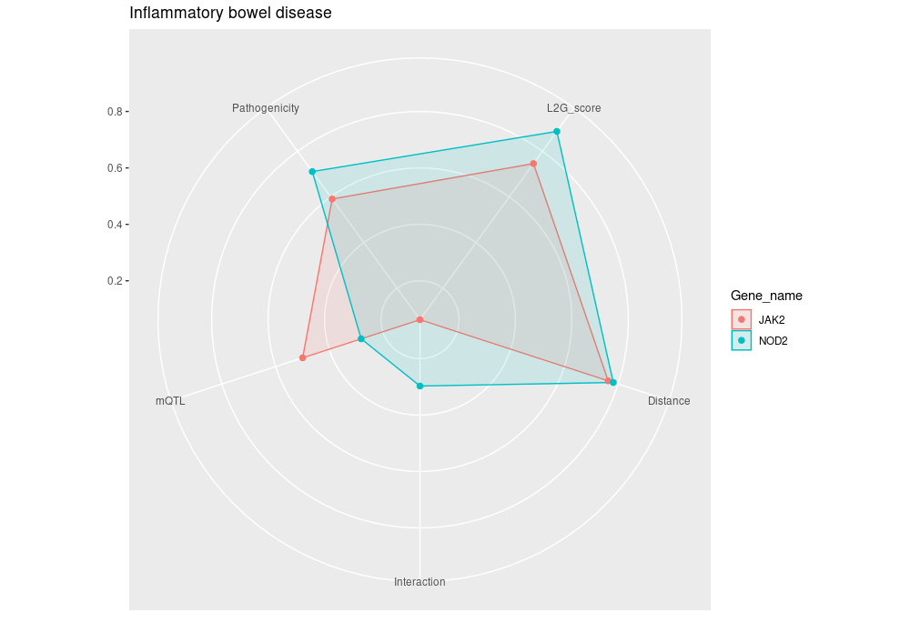

[Open Targets Genetics](https://genetics.opentargets.org/) offers a [GraphQL](https://graphql.org/) interface to access different variant-centred statistical summary data types. To query the genetic portal using GraphQL, users can send web requests by command line tools such as curl and wget, execute queries from provided browser endpoint, or connect from R and Python environment. Although these APIs help with data access, there are several existing challenges with each approach which makes the data retrieval non-efficient. Moreover, GraphQL queries return data in json format which are often complex and nested, converting the return data into tidy data tables is another shared complaint among the users. 

Due to the popularity of R in bioinformatics and genetics research, we have developed `otargen`, a R package based on graphql that offers diverse functionalities for seamless data retrieval with tidy data table outputs, plotting essential calculated information, and executing custom queries. `Otargen` simplifies the process of accessing data and facilitates systematic access to OTG data from R, which allows efficient integration of genetic evidence with the data-driven target discovery pipelines.. The data primarily revolves around 3 key components: `studyid`, `variantid` and `geneid`. Given below are a few examples on how to retrieve and plot data using the package.

## Examples

**1. Retrieve colocalisation data for one or more `genes`:** Studies which have evidence of colocalisation of genetic variants associated with both molecular traits (such as gene expression levels or protein levels) and complex traits within the same genomic regions.

``` r
library(otargen)

colocalisationsForGene(genes=list("ENSG00000163946","ENSG00000169174", "ENSG00000143001"))

# A tibble: 668 × 20
   Study    Trait_reported Lead_variant Molecular_trait Gene_symbol Tissue Source    H3    H4   `log2(H4/H3)`
   <chr>    <chr>          <chr>        <chr>           <chr>       <chr>  <chr>  <dbl> <dbl>         <dbl>
 1 GCST900… Mean platelet… 3_56619974_… TASOR           ENSG000001… blood  Lepik…     0     1         17.3 
 2 GCST900… Direct low de… 1_55029009_… PCSK9           ENSG000001… iPSC   PhLiPS     0     1         11.4 
 3 GCST900… Direct low de… 1_55029009_… PCSK9           ENSG000001… iPSC   iPSCO…     0     1         11.3 
 4 GCST900… Direct low de… 1_55029009_… PCSK9           ENSG000001… iPSC   HipSci     0     1         11.3 
 5 GCST900… High choleste… 1_55025188_… PCSK9           ENSG000001… tibia… GTEx-…     0     1         10.7 
 6 NEALE2_… Yes, because … 1_55026242_… PCSK9           ENSG000001… tibia… GTEx-…     0     1         10.4 
 7 SAIGE_2… Hyperlipidemia 1_55023869_… PCSK9           ENSG000001… lung   GTEx-…     0     1          9.82
 8 SAIGE_2… Hypercholeste… 1_55023869_… PCSK9           ENSG000001… lung   GTEx-…     0     1          9.79
 9 SAIGE_2… Disorders of … 1_55023869_… PCSK9           ENSG000001… lung   GTEx-…     0     1          9.77
10 SAIGE_2… Hyperlipidemia 1_55023869_… PCSK9           ENSG000001… tibia… GTEx-…     0     1          9.77
# ℹ 658 more rows
# ℹ 10 more variables: Title <chr>, Author <chr>, Has_sumstats <lgl>, numAssocLoci <dbl>,
#   `nInitial cohort` <dbl>, study_nReplication <dbl>, study_nCases <dbl>, Publication_date <chr>,
#   Journal <chr>, Pubmed_id <chr>
```

**2. Retrieve qtl credible set data for a given `gene`, `studyid`, `variantid` and `biofeature`.**
The function obtains tag variant information that are considered to have a high probability of being 
truly associated with the trait and the corresponding scores.

``` r
qtl_cred_set <- qtlCredibleSet(studyid="Braineac2", variantid="rs7552841", gene="PCSK9", biofeature="SUBSTANTIA_NIGRA")
head(qtl_cred_set)

   tagVariant.id tagVariant.rsId        pval       se      beta    postProb MultisignalMethod   logABF is95 is99
1 1_55052794_A_G              NA 0.000151568 0.166373 -0.681090 0.002299181       conditional 2.726953 TRUE TRUE
2 1_55054539_G_A              NA 0.000482125 0.193346  0.721143 0.001422319       conditional 2.246689 TRUE TRUE
3 1_55241800_A_G              NA 0.000634235 0.181505  0.660898 0.001326061       conditional 2.176614 TRUE TRUE
4 1_55246294_A_G              NA 0.000527554 0.181065  0.670092 0.001424974       conditional 2.248554 TRUE TRUE
5 1_55248288_C_T              NA 0.000650165 0.182720  0.663849 0.001293980       conditional 2.152124 TRUE TRUE
6 1_55248542_G_A              NA 0.000650880 0.182789  0.664035 0.001293430       conditional 2.151698 TRUE TRUE
```

**3. Retrieves L2G model summary data for `gene(s)`.** The locus-to-gene model utilizes genetic and functional genomics features to obtain prioritization scores for likely causal genes at each GWAS locus. The output can be further filtered by providing `l2g` score, `pvalue` and `vtype`. `vtype` refers to the mostSevereConsequence of a variant on the associated gene.

``` r
l2g_results <- studiesAndLeadVariantsForGeneByL2G(genes = "PCSK9", l2g = 0.6, pvalue = 1e-8, vtype = c("intergenic_variant", "intron_variant"))
l2g_results %>% as_tibble()

# A tibble: 40 × 39
   yProbaModel yProbaDistance yProbaInteraction yProbaMolecularQTL yProbaPathogenicity     pval beta.direction beta.betaCI
         <dbl>          <dbl>             <dbl>              <dbl>               <dbl>    <dbl> <chr>                <dbl>
 1       0.618          0.544             0.056              0.221               0.615 4.79e-12 +                   0.394 
 2       0.631          0.761             0.284              0.155               0.058 5.23e-20 -                  -0.0687
 3       0.631          0.757             0.284              0.155               0.058 3.54e-20 -                  -0.0668
 4       0.647          0.739             0.25               0.138               0.182 3   e-47 -                  -0.0544
 5       0.652          0.614             0.171              0.637               0.344 3.60e-14 +                   0.0156
 6       0.656          0.765             0.284              0.279               0.058 1.13e-41 -                  -0.069 
 7       0.656          0.765             0.284              0.279               0.058 2.38e-53 -                  -0.0831
 8       0.66           0.69              0.171              0.487               0.047 1   e- 8 -                  NA     
 9       0.663          0.756             0.206              0.33                0.056 1   e-10 -                  -0.03  
10       0.664          0.767             0.206              0.614               0.057 1.90e-88 -                  -0.0487
# ℹ 30 more rows
# ℹ 31 more variables: beta.betaCILower <dbl>, beta.betaCIUpper <dbl>, odds.oddsCI <dbl>, odds.oddsCILower <dbl>,
#   odds.oddsCIUpper <dbl>, study.studyId <chr>, study.traitReported <chr>, study.traitCategory <chr>, study.pubDate <chr>,
#   study.pubTitle <chr>, study.pubAuthor <chr>, study.pubJournal <chr>, study.pmid <chr>, study.hasSumstats <lgl>,
#   study.nCases <int>, study.numAssocLoci <int>, study.nTotal <int>, study.traitEfos <chr>, variant.id <chr>, variant.rsId <chr>,
#   variant.chromosome <chr>, variant.position <int>, variant.refAllele <chr>, variant.altAllele <chr>,
#   variant.nearestCodingGeneDistance <int>, variant.nearestGeneDistance <int>, variant.mostSevereConsequence <chr>, …
```

**4. Obtain detailed information about all the genes present in a given region of a specified `chromosome`.**

``` r
get_genes(chromosome = "2", start = 239634984, end = 241634984)

# A tibble: 27 × 10
   id              symbol  bioType        description                                   chromosome    tss  start    end fwdStrand exons
   <chr>           <chr>   <chr>          <chr>                                         <chr>       <int>  <int>  <int> <lgl>     <lis>
 1 ENSG00000006607 FARP2   protein_coding FERM, ARH/RhoGEF and pleckstrin domain prote… 2          2.41e8 2.41e8 2.41e8 TRUE      <int>
 2 ENSG00000063660 GPC1    protein_coding glypican 1 [Source:HGNC Symbol;Acc:HGNC:4449] 2          2.40e8 2.40e8 2.40e8 TRUE      <int>
 3 ENSG00000115677 HDLBP   protein_coding high density lipoprotein binding protein [So… 2          2.41e8 2.41e8 2.41e8 FALSE     <int>
 4 ENSG00000115685 PPP1R7  protein_coding protein phosphatase 1 regulatory subunit 7 [… 2          2.41e8 2.41e8 2.41e8 TRUE      <int>
 5 ENSG00000115687 PASK    protein_coding PAS domain containing serine/threonine kinas… 2          2.41e8 2.41e8 2.41e8 FALSE     <int>
 6 ENSG00000115694 STK25   protein_coding serine/threonine kinase 25 [Source:HGNC Symb… 2          2.42e8 2.41e8 2.42e8 FALSE     <int>
 7 ENSG00000122085 MTERF4  protein_coding mitochondrial transcription termination fact… 2          2.41e8 2.41e8 2.41e8 FALSE     <int>
 8 ENSG00000130294 KIF1A   protein_coding kinesin family member 1A [Source:HGNC Symbol… 2          2.41e8 2.41e8 2.41e8 FALSE     <int>
 9 ENSG00000130414 NDUFA10 protein_coding NADH:ubiquinone oxidoreductase subunit A10 [… 2          2.40e8 2.40e8 2.40e8 FALSE     <int>
10 ENSG00000142327 RNPEPL1 protein_coding arginyl aminopeptidase like 1 [Source:HGNC S… 2          2.41e8 2.41e8 2.41e8 TRUE      <int>
# ℹ 17 more rows
# ℹ Use `print(n = ...)` to see more rows
```

**5. Plot data obtained from the *manhattan* function.** 
A Manhattan plot is used to represent genetic association studies. Here, the plot displays the associated p-value (-log10(P)) for genetic variants across the genome, plotted against their chromosomal regions.

``` r
manhattan(studyid = "GCST003044") %>% plot_manhattan()
```



**6. Plot data obtained from the *PheWAS* function.** Phenome wide association study results are filtered for diseases and the -log10 p-value is plotted against the traits. It presents the association results between genetic variants and multiple traits. The traits with p-value \< 0.005 is labelled.

``` r
pheWAS(variantid = "14_87978408_G_A") %>% plot_phewas(disease = TRUE)
```



**7. Plot the scores obtained from the *studiesAndLeadVariantsForGeneByL2G* function and filter it for a specific `disease`.** A radar plot showing the scores important for prioritising the causal genes.

``` r
studiesAndLeadVariantsForGeneByL2G(list("ENSG00000167207","ENSG00000096968","ENSG00000138821", "ENSG00000125255")) %>% plot_l2g(disease = "EFO_0003767")
```


