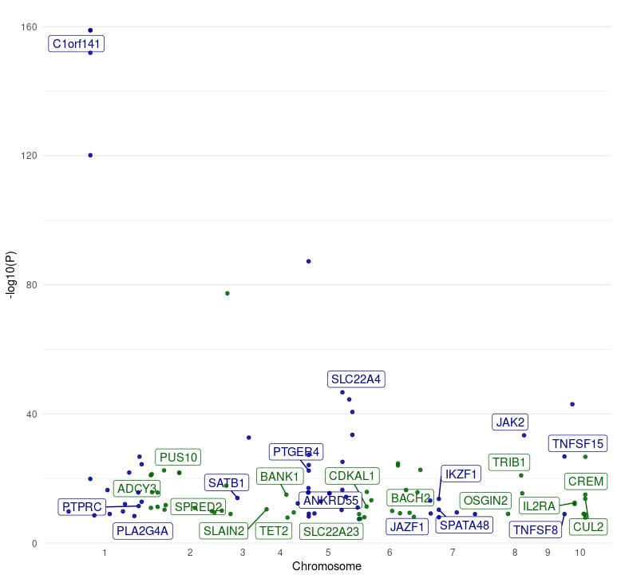
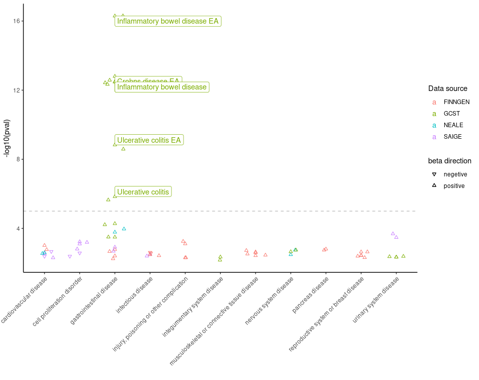
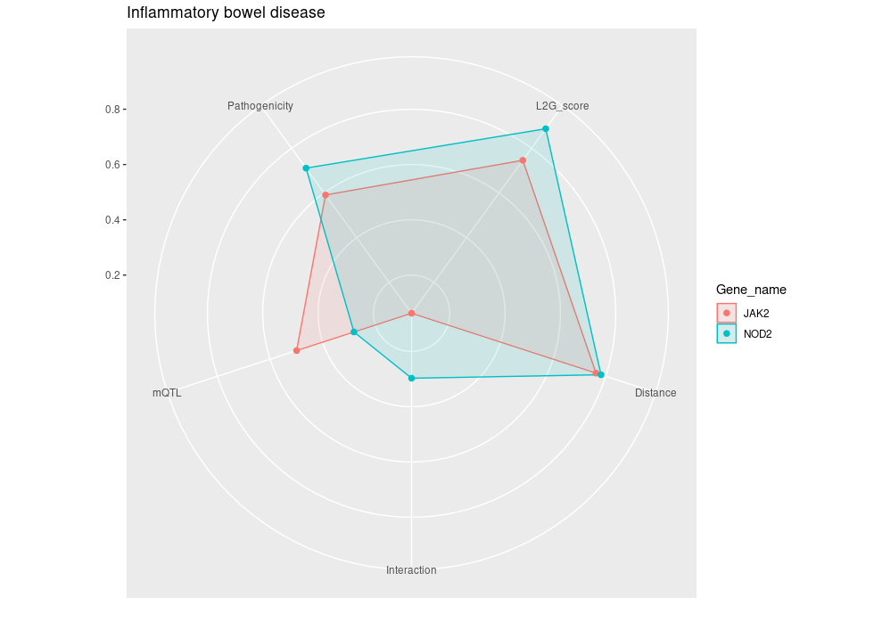
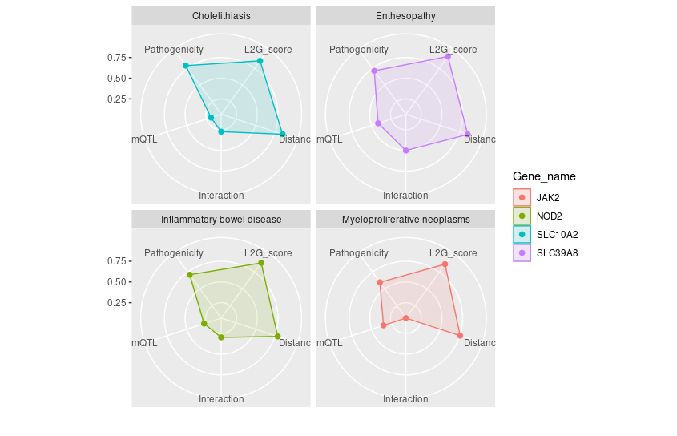

## Example 1: Unveiling Colocalisation Secrets

- **Objective**: 🕵️‍♂️ Explore shared genetic territories with `colocalisationsForGene()`. Peek into the genetic overlap that may influence multiple traits within the same genomic neighborhood.
- **Function**: `colocalisationsForGene()`
- **Parameters**: 
  - `genes`: A vector of intriguing gene identifiers.

``` r
library(otargen)


# Specify the genes of interest
genes_of_interest <- c("ENSG00000163946", "ENSG00000169174", "ENSG00000143001")

# Retrieve colocalization data
coloc_data <- colocalisationsForGene(genes = genes_of_interest)

head(coloc_data)

# A tibble: 668 × 20
   Study    Trait_reported Lead_variant Molecular_trait Gene_symbol Tissue Source    H3    H4   `log2(H4/H3)`
   <chr>    <chr>          <chr>        <chr>           <chr>       <chr>  <chr>  <dbl> <dbl>         <dbl>
 1 GCST900… Mean platelet… 3_56619974_… TASOR           ENSG000001… blood  Lepik…     0     1         17.3 
 2 GCST900… Direct low de… 1_55029009_… PCSK9           ENSG000001… iPSC   PhLiPS     0     1         11.4 
 3 GCST900… Direct low de… 1_55029009_… PCSK9           ENSG000001… iPSC   iPSCO…     0     1         11.3 
 4 GCST900… Direct low de… 1_55029009_… PCSK9           ENSG000001… iPSC   HipSci     0     1         11.3 
 5 GCST900… High choleste… 1_55025188_… PCSK9           ENSG000001… tibia… GTEx-…     0     1         10.7 
 6 NEALE2_… Yes, because … 1_55026242_… PCSK9           ENSG000001… tibia… GTEx-…     0     1         10.4 
 7 SAIGE_2… Hyperlipidemia 1_55023869_… PCSK9           ENSG000001… lung   GTEx-…     0     1          9.82
 8 SAIGE_2… Hypercholeste… 1_55023869_… PCSK9           ENSG000001… lung   GTEx-…     0     1          9.79
 9 SAIGE_2… Disorders of … 1_55023869_… PCSK9           ENSG000001… lung   GTEx-…     0     1          9.77
10 SAIGE_2… Hyperlipidemia 1_55023869_… PCSK9           ENSG000001… tibia… GTEx-…     0     1          9.77
# ℹ 658 more rows
# ℹ 10 more variables: Title <chr>, Author <chr>, Has_sumstats <lgl>, numAssocLoci <dbl>,
#   `nInitial cohort` <dbl>, study_nReplication <dbl>, study_nCases <dbl>, Publication_date <chr>,
#   Journal <chr>, Pubmed_id <chr>
```


## Example 2: Quest for QTL Credible Set Data

- **Objective**: 🔍 Delve into QTLs data with `qtlCredibleSet()`. Unravel all tag variants and their connection to traits, one credible set at a time.
- **Function**: `qtlCredibleSet()`
- **Parameters**:
  - `study_id`, `variant_id`, `gene`, `biofeature`: Keys to unlock the treasure trove of QTL data.


``` r
# Retrieve QTL credible set data
qtl_cred_set <- qtlCredibleSet(studyid = "Braineac2", variantid = "rs7552841",
                              gene = "PCSK9", biofeature = "SUBSTANTIA_NIGRA")

# Display the first few rows of the QTL credible set data
head(qtl_cred_set)


   tagVariant.id tagVariant.rsId        pval       se      beta    postProb MultisignalMethod   logABF is95 is99
1 1_55052794_A_G              NA 0.000151568 0.166373 -0.681090 0.002299181       conditional 2.726953 TRUE TRUE
2 1_55054539_G_A              NA 0.000482125 0.193346  0.721143 0.001422319       conditional 2.246689 TRUE TRUE
3 1_55241800_A_G              NA 0.000634235 0.181505  0.660898 0.001326061       conditional 2.176614 TRUE TRUE
4 1_55246294_A_G              NA 0.000527554 0.181065  0.670092 0.001424974       conditional 2.248554 TRUE TRUE
5 1_55248288_C_T              NA 0.000650165 0.182720  0.663849 0.001293980       conditional 2.152124 TRUE TRUE
6 1_55248542_G_A              NA 0.000650880 0.182789  0.664035 0.001293430       conditional 2.151698 TRUE TRUE
```


## Example 3: L2G Model Data Odyssey

- **Objective**: 🚀 Navigate through the genetic cosmos with `studiesAndLeadVariantsForGeneByL2G()`. L2G model is the core development of Open Target Genetics platform and it is your star map to identify potential causal genes across the GWAS universe.

- **Function**: `studiesAndLeadVariantsForGeneByL2G()`
- **Parameters**:
  - `gene`, `l2g`, `pvalue`, `vtype`: parameters to guide your exploration.


``` r
# Retrieve L2G results for the gene PCSK9 with specified filters
l2g_results <- studiesAndLeadVariantsForGeneByL2G(
  gene = "PCSK9",
  l2g = 0.6,
  pvalue = 1e-8,
  vtype = c("intergenic_variant", "intron_variant")
)

# Display the results as a tibble for easier analysis
l2g_results %>% as_tibble()

# A tibble: 40 × 39
   yProbaModel yProbaDistance yProbaInteraction yProbaMolecularQTL yProbaPathogenicity     pval beta.direction beta.betaCI
         <dbl>          <dbl>             <dbl>              <dbl>               <dbl>    <dbl> <chr>                <dbl>
 1       0.618          0.544             0.056              0.221               0.615 4.79e-12 +                   0.394 
 2       0.631          0.761             0.284              0.155               0.058 5.23e-20 -                  -0.0687
 3       0.631          0.757             0.284              0.155               0.058 3.54e-20 -                  -0.0668
 4       0.647          0.739             0.25               0.138               0.182 3   e-47 -                  -0.0544
 5       0.652          0.614             0.171              0.637               0.344 3.60e-14 +                   0.0156
 6       0.656          0.765             0.284              0.279               0.058 1.13e-41 -                  -0.069 
 7       0.656          0.765             0.284              0.279               0.058 2.38e-53 -                  -0.0831
 8       0.66           0.69              0.171              0.487               0.047 1   e- 8 -                  NA     
 9       0.663          0.756             0.206              0.33                0.056 1   e-10 -                  -0.03  
10       0.664          0.767             0.206              0.614               0.057 1.90e-88 -                  -0.0487
# ℹ 30 more rows
# ℹ 31 more variables: beta.betaCILower <dbl>, beta.betaCIUpper <dbl>, odds.oddsCI <dbl>, odds.oddsCILower <dbl>,
#   odds.oddsCIUpper <dbl>, study.studyId <chr>, study.traitReported <chr>, study.traitCategory <chr>, study.pubDate <chr>,
#   study.pubTitle <chr>, study.pubAuthor <chr>, study.pubJournal <chr>, study.pmid <chr>, study.hasSumstats <lgl>,
#   study.nCases <int>, study.numAssocLoci <int>, study.nTotal <int>, study.traitEfos <chr>, variant.id <chr>, variant.rsId <chr>,
#   variant.chromosome <chr>, variant.position <int>, variant.refAllele <chr>, variant.altAllele <chr>,
#   variant.nearestCodingGeneDistance <int>, variant.nearestGeneDistance <int>, variant.mostSevereConsequence <chr>, …
```
*from Open Target Genetics portal* 

> Interpreting the L2G score
> The L2G model produces a score, ranging from 0 to 1, which reflects the approximate fraction of GSP genes among all genes near a given threshold. This can be interpreted to say that genes with an L2G score of 0.5 have a 50% chance of being the causal gene at the locus, under the assumption that the model is correct and the locus itself is similar to those in our gold-standard training data.
> *Note*: Because models don't generalize perfectly, the true fraction of causal genes at an L2G score of 0.5 is likely to be less than 50%.
> A key strength of the L2G score is that it aggregates information over all credible set variants, rather than looking only at the distance from the lead GWAS variant to genes.


## Example 4: Chromosomal Expedition

- **Objective**: 🌌 Traverse the genomic landscape with `getLociGenes()`. Chart the composition of genes within any specified chromosomal region and obtain detailed information on each gene in a tidy dataframe.
- **Function**: `getLociGenes()`
- **Parameters**:
  - `chromosome`, `start`, `end`: The geographic coordinates of your genomic exploration.


``` r
# Retrieve genes within a genomic region on chromosome 2
genes_table <- getLociGenes(chromosome = "2", start = 239634984, end = 241634984)

# Display the resulting table
genes_table


# A tibble: 27 × 10
   id              symbol  bioType        description                                   chromosome    tss  start    end fwdStrand exons
   <chr>           <chr>   <chr>          <chr>                                         <chr>       <int>  <int>  <int> <lgl>     <lis>
 1 ENSG00000006607 FARP2   protein_coding FERM, ARH/RhoGEF and pleckstrin domain prote… 2          2.41e8 2.41e8 2.41e8 TRUE      <int>
 2 ENSG00000063660 GPC1    protein_coding glypican 1 [Source:HGNC Symbol;Acc:HGNC:4449] 2          2.40e8 2.40e8 2.40e8 TRUE      <int>
 3 ENSG00000115677 HDLBP   protein_coding high density lipoprotein binding protein [So… 2          2.41e8 2.41e8 2.41e8 FALSE     <int>
 4 ENSG00000115685 PPP1R7  protein_coding protein phosphatase 1 regulatory subunit 7 [… 2          2.41e8 2.41e8 2.41e8 TRUE      <int>
 5 ENSG00000115687 PASK    protein_coding PAS domain containing serine/threonine kinas… 2          2.41e8 2.41e8 2.41e8 FALSE     <int>
 6 ENSG00000115694 STK25   protein_coding serine/threonine kinase 25 [Source:HGNC Symb… 2          2.42e8 2.41e8 2.42e8 FALSE     <int>
 7 ENSG00000122085 MTERF4  protein_coding mitochondrial transcription termination fact… 2          2.41e8 2.41e8 2.41e8 FALSE     <int>
 8 ENSG00000130294 KIF1A   protein_coding kinesin family member 1A [Source:HGNC Symbol… 2          2.41e8 2.41e8 2.41e8 FALSE     <int>
 9 ENSG00000130414 NDUFA10 protein_coding NADH:ubiquinone oxidoreductase subunit A10 [… 2          2.40e8 2.40e8 2.40e8 FALSE     <int>
10 ENSG00000142327 RNPEPL1 protein_coding arginyl aminopeptidase like 1 [Source:HGNC S… 2          2.41e8 2.41e8 2.41e8 TRUE      <int>
# ℹ 17 more rows
# ℹ Use `print(n = ...)` to see more rows
```


## Example 5: ️Manhattan Plot Skylines

- **Objective**: 🏙️ Construct manahatan plot from GWAS data combining two functions `manhattan()` and `plot_manhattan()`. As it is designed *manhatan plot* visualize the p-value peaks that rise from the genomic plains, marking the locations of significant associations.
- **Function**: `manhattan()` followed by `plot_manhattan()`
- **Parameters**:
  - `study_id`: The identifier for the GWAS study of interest.


``` r
manhattan(study_id = "GCST003044") %>% plot_manhattan()
```




## Example 6: PheWAS Plot Panorama

- **Objective**: 🌍  Exploration associations of a specific variant across myriads of phenotype combining `pheWAS()` and `plot_phewas()`functions. `plot_phewas` allows to survey the landscape of trait associations with color-coded insights into disease relevance.
- **Function**: `pheWAS()` followed by `plot_phewas()`
- **Parameters**:
  - `variant_id`: Identifier for the variant of interest.
  - `disease`: A logical flag to filter for disease-associated traits.


**6. Plot data obtained from the *PheWAS()* function.** 

A Phenome-Wide Association Study (PheWAS) analyzes the association between genetic variants and a wide range of phenotypic traits.
To retrieve PheWAS analysis results for a variant, you can use `pheWAS()` function in `otargen` which returns a tidy data table
of all calculated statistics for association of the specified variant across many traits in *UK Biobank*, *FinnGen*,
' and or *GWAS Catalog*. Now, as shown in below example snippet piping, output of `pheWAS()` to `plot_phewas()` will 
return you a nice scatter plot with useful color codes to interpret those associations! It is even more fun, that the plot allows
to choose if you are only interested to keep disease associated variants in the plot. 


``` r
pheWAS(variant_id = "14_87978408_G_A") %>% plot_phewas(disease = TRUE)
```




## Example 7: Navigating Genetic Insights with Radar Plots

- **Objective**: 🌐 Use the radar plot as your navigational compass to interpret the complex output of  `studiesAndLeadVariantsForGeneByL2G()` by `plot_l2g()`. This visualization helps you to chart a course through all partial scores from L2G model to prioritizing gene-trait associations like waypoints on a radar screen guiding you for further exploration.
- **Function**: `studiesAndLeadVariantsForGeneByL2G()` followed by `plot_l2g()`
- **Parameters**:
  - List of `gene`: Identifiers for genes of interest.
  - `disease` (optional): If specified, focuses the analysis on a single disease. Leave this parameter empty if you wish to be disease-agnostic and prioritize diseases for each gene based on their L2G model score associations.

  - `top_n_disease` (default: `1`): Determines the number of top diseases to plot for each gene, ranked by L2G score. Increase this value to include more diseases in the analysis. Use in conjunction with being disease-agnostic to dynamically select the top diseases for each gene.

  - `l2g_cutoff` (default: `0.5`): Sets the minimum L2G score threshold for diseases to be considered in the plot. Increasing this value can help reduce plot clutter by focusing on higher-confidence associations.

``` r
# Retrieve L2G model statistics for a list of genes

genes = list("ENSG00000167207","ENSG00000096968","ENSG00000138821", "ENSG00000125255")
l2g_results <- studiesAndLeadVariantsForGeneByL2G()
```
```r
# Generate radar plot of L2G scores for Iflammatory bowel disease with EFO ID: "EFO_0003767"
plot_l2g(l2g_results, disease = "EFO_0003767")
```


```r

# Generate radar plot of L2G scores (l2g score >0.8), without disease parameters specified. 
plot_l2g(l2g_results,l2g_cutoff = 0.8)
```



